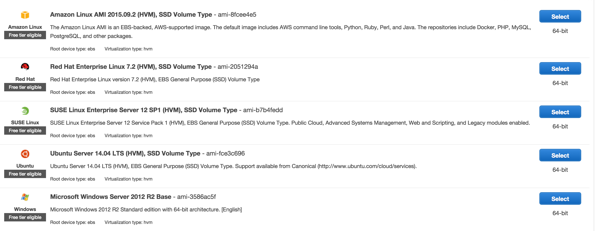

# Setting up EC2 Instances to Run R

##Tutorial 1:  
This first tutorial will walk you through **setting up an Ubuntu instance on EC2 and installing Git and the “LAMP” stack**. You may not need these right now, but the package installation process might be helpful to learn and you will likely need Apache and MySQL in the future: http://devoncmather.com/setting-aws-ec2-instance-lamp-git/

**The following are some corrections to the tutorial listed above.** 

#### Choose an Amazon Machine Image (AMI):
Choose Ubuntu Server 14.04 LTS (HVM).

#### EC2 Security Group:  
If one want to use RStudio Server, one more rule need to be added into the Security Group.  
Edit Inbound Rules as the following:  

#### Connecting to server with your PEM Key using SSH:  
Use chmod 400 path/to/yourkeyname.pem rather than chmod 600 to make the key public.

#### Connecting with SSH without a PEM key  
The correct content in the ~/.ssh/config should be:  

	Host "The name you want to put after ssh command" 
	Hostname "the public IP of Instance"  
	User ubuntu
	IdentityFile "path to locate the public key (.pem downloaded from Amazon)"  

**The quotation mark is not needed**

Then Type:  

	Esc:wq  

to exit the vim interface.
	
Then I can use   

	$ ssh EC2test 
	
to log in my instance.

#### Setup GIT for web deployment and version control
Install git by typing:

	$ sudo apt-get install git
	
Then link to your own Git repos by cloning. 

##Tutorial 2:  
This second tutorial will walk you through **installing of R and R studio**: http://randyzwitch.com/r-amazon-ec2/

**The following are some corrections to the tutorial listed above.** 

#### Installing Base R:  
The correct URL of CRAN mirror in the custom sources.list file should be:
	
	https://lib.stat.cmu.edu/R/CRAN/bin/linux/ubuntu/ precise/  

Therefore, the content in /etc/apt/sources.list.d/sources.list is:  

	deb https://lib.stat.cmu.edu/R/CRAN/bin/linux/ubuntu/ precise/

##### Update on installing Base R (2/25/16):
The URL above doesn't work. This works:
	
	http://lib.stat.cmu.edu/R/CRAN/bin/linux/ubuntu/ trusty/  

If installing R doesn't work, check R mirror URL and ubuntu version. 

After running 

	$ sudo apt-get update
	
The error message is about public key not available. Any other error messages mean the URL is wrong. 

#### Installing RStudio Server:  
Just follow these commands to install RStudio

	$ sudo apt-get install gdebi-core
	$ wget https://download2.rstudio.org/rstudio-server-0.99.887-amd64.deb
	$ sudo gdebi rstudio-server-0.99.887-amd64.deb
	
#### Logging into RStudio Server: 
	AWS Public DNS + EC2 Security Group port (8787)
	Username: User name you put in code when setting up RStudio
	Password: Password you entered when setting up RStudio

